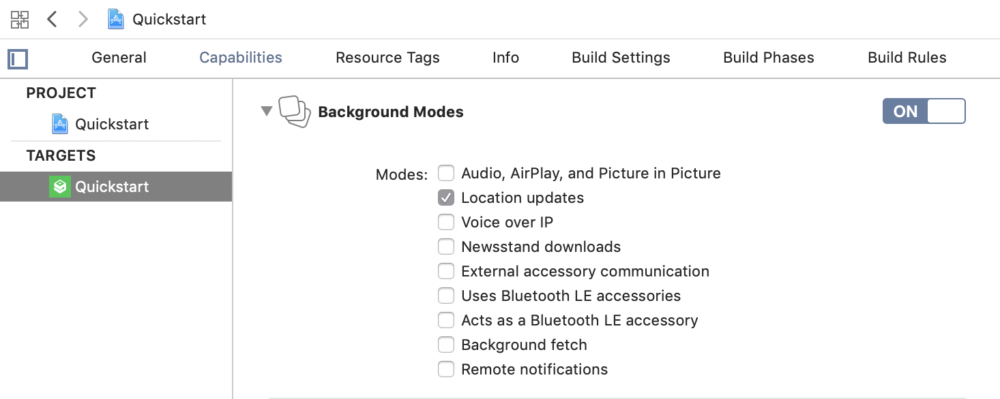

# React Native module for HyperTrack SDKs

## Installing the SDK

This guide will help you setup the React Native module in your application. The module is built on top of native iOS and Android SDKs, which collect location, activity and device health. The module exposes methods to start and stop tracking, and interact with the HyperTrack APIs.

In case you are not using React Native, you can refer to the [iOS](https://github.com/hypertrack/quickstart-ios) or [Android](https://github.com/hypertrack/quickstart-android) versions.

### Step 1: Install the module

In your project directory, install from npm, and then link it.

```bash
$ npm install hypertrack-sdk-react-native --save
$ react-native link hypertrack-sdk-react-native
```

### Step 2: Setup native dependencies
#### iOS

1. The native iOS SDKs need to be setup using Cocoapods. In your project's `ios` directory, create a Podfile.

```bash
$ cd ios
$ pod init
```

2. Edit the Podfile to include `HyperTrack` as a dependency for your project, and then install the pod.

```bash
platform :ios, '10.0'

target 'AppName' do
  use_frameworks!
  pod 'HyperTrack'
end

post_install do |installer|
  installer.pods_project.targets.each do |target|
    if ['GRDB.swift', 'CocoaLumberjack'].include? target.name
      target.build_configurations.each do |config|
        config.build_settings['SWIFT_VERSION'] = '4.2'
      end
    end
  end
end
```

3. Manually link the wrapper code.

After the Cocoapods are setup, we need to manually link the wrapper code. This is a **required** step, in addition to the link command described previously.

1. Open the iOS module files, located inside `node_modules/hypertrack-sdk-react-native/ios/`.
2. Open the app workspace file (AppName.xcworkspace) in Xcode.
3. Move the `RNHyperTrack.h` and `RNHyperTrack.m` files to your project. When shown a popup window, select `Create groups`.


4. Check the Swift version in build settings

Select the projects Xcode project file in the navigator, go to your app's target > Build Settings > All and search for `SWIFT_VERSION` flag. If there isn't one, create it using a name `SWIFT_VERSION` and set it to a minimum of `Swift 5`.


### Android

1. Update compileSdkVersion, buildToolsVersion, support library version
Edit the `build.gradle` file in your `android/app` directory

```groovy
android {
    compileSdkVersion 26
    buildToolsVersion "26.0.3"
    ...
}
```

```groovy
dependencies {
    ...
    compile project(':react-native-hypertrack')
    compile fileTree(dir: "libs", include: ["*.jar"])
    compile "com.android.support:appcompat-v7:26.1.0"
    compile "com.facebook.react:react-native:+"  // From node_modules
    ...
}
```

2. Add maven for Google Play Service Libraries
Edit the `build.gradle` file in your `android` directory

```groovy
// Top-level build file where you can add configuration options common to all sub-projects/modules.
buildscript {
    repositories {
        jcenter()
        maven {
            url 'https://maven.google.com/'
            name 'Google'
        }
    }
    dependencies {
        classpath 'com.android.tools.build:gradle:3.0.1'
        classpath 'com.google.gms:google-services:3.1.0'

        // NOTE: Do not place your application dependencies here; they belong
        // in the individual module build.gradle files
    }
}

allprojects {
    repositories {
        mavenLocal()
        jcenter()
        maven {
            // All of React Native (JS, Obj-C sources, Android binaries) is installed from npm
            url "$rootDir/../node_modules/react-native/android"
        }
        maven {
            url 'https://maven.google.com/'
            name 'Google'
        }
    }
}
```

### Step 3: Importing the module
#### iOS

```js
import { NativeModules } from 'react-native';
var RNHyperTrack = NativeModules.RNHyperTrack;
```

#### Android

```js
import RNHyperTrack from 'react-native-hypertrack';
```

#### Combined

If you have a common app file for both Android and iOS, you can use the following snippet to define `RNHyperTrack`.

```js
import { NativeModules } from 'react-native';
import {RNHyperTrack as RNHyperTrackImport} from 'react-native-hypertrack';

if (NativeModules.RNHyperTrack != undefined) {
  // Import for iOS setup
  var RNHyperTrack = NativeModules.RNHyperTrack;
} else {
  // Import for Android setup
  var RNHyperTrack = RNHyperTrackImport;
}
```

### Step 4: Configure the API key

To configure the SDK, set the publishable key. This can be done in the `constructor` of your component class.

```js
export default class MyApp extends Component {
  constructor() {
    super();
    // Initialize HyperTrack wrapper
    RNHyperTrack.initialize('YOUR_PUBLISHABLE_KEY');
  }
}
```

### Step 5: Native capabilities on iOS

#### Enable background location updates

Enable Background Modes in your project target's Capabilities tab. Choose "Location updates".



#### Add purpose strings

Set the following purpose strings in the `Info.plist` file:


Include `Privacy - Location Always Usage Description` key only when you need iOS 10 compatibility.

You can ask for "When In Use" permission only, but be advised that the device will see a blue bar at the top while your app is running.


Be advised, purpose strings are mandatory, and the app crashes without them.
